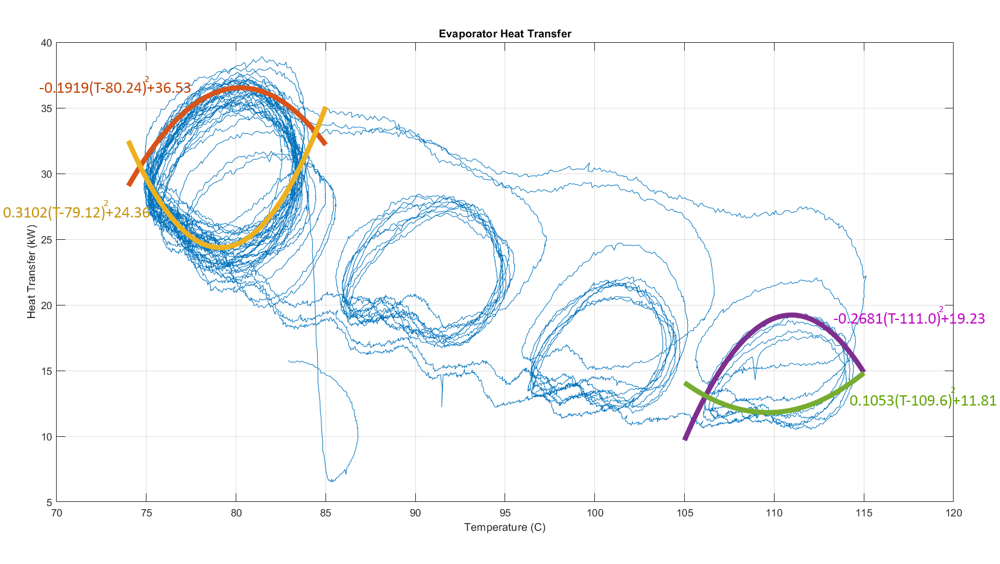

# Oil Heater Simulation

An oil heater cycle is modeled by MATLAB/Simulink as graduation project in the Boğaziçi University's **ME 492** class.

The oil cycle is a part of the Organic Rankine Cycle located at the [BURET Lab](http://buret.boun.edu.tr/facilities/organic-rankine-cycle/) of Boğaziçi University. The oil is used to heat up the working fluid R134A. The oil undergoes four different components, including a pump, heater, evaporator, and tank. The system, including the four components, is modeled in MATLAB/Simulink by using governing differential equations and experimental data.

The simulink models and the LaTeX code can be found [here](https://github.com/edizferit/Oil-Heater-Simulation).

---

The diagram that represents the oil cycle and the default control strategy applied at the heater to keep the oil at the desired temperature is given below:

Curve fitting techniques are applied to the experimental data to obtain several variables. Below figue is an example showing the fitted functions which are used to find the heat transfer at the evaporator with respect to the temperature.

The experimental data is split to two parts as training and validation, which can be seen below:

